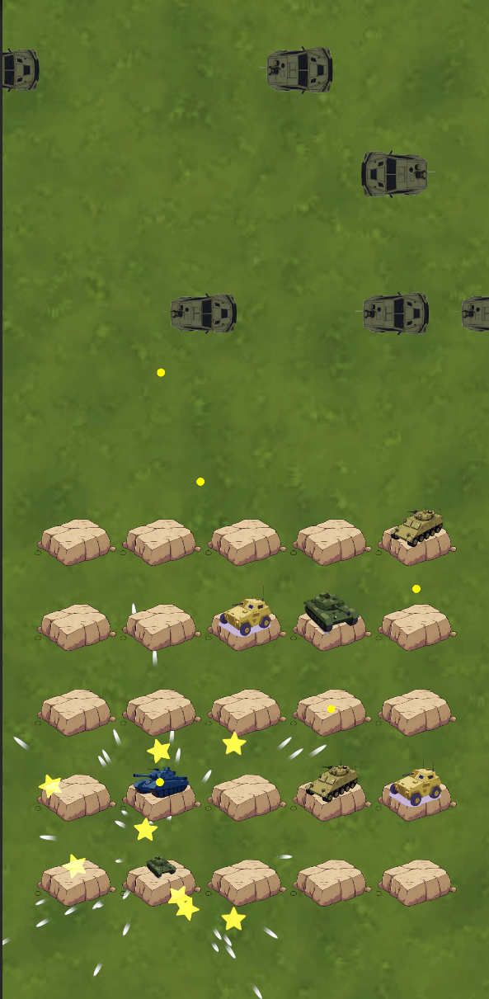

# Merge2 — Тестовое задание

### Описание
Простая игра в жанре Merge2, выполненная в качестве тестового задания.

Основная механика: перетаскивание одинаковых танков друг на друга → слияние в танк следующего уровня.

### Использованные инструменты и библиотеки
- **VContainer** — лёгкий и быстрый DI-контейнер (альтернатива Zenject)
- **DOTween** — плавные и удобные анимации (движение, bounce-эффекты при мержe)
- **UniTask** — асинхронные операции вместо корутин + удобная интеграция с DOTween
- **Unity Input System** — обработка drag & drop
- **MVC** — архитектура проекта: чёткое разделение на Model, View и Controller